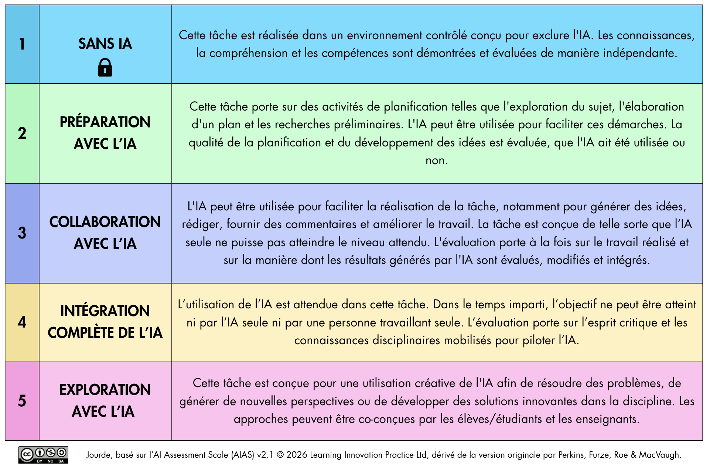
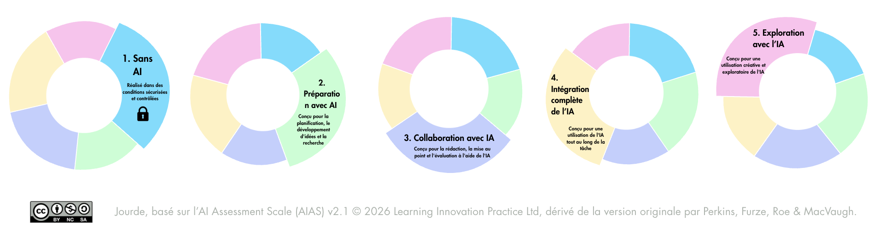

# Échelle ou cadre d’utilisation de l’intelligence artificielle générative dans l’évaluation des apprentissages - v2.1.

> [!NOTE]
> Un cadre en cinq niveaux pour aider les enseignants à déterminer le rôle de l’IA dans une évaluation et à (re)concevoir les tâches d’évaluation.

# Présentation générale

L’échelle ou le cadre d’intégration de l’IA générative dans les évaluations de l’apprentissage est la traduction française de l’*AI Assessment Scale* (AIAS), actuellement proposé en version 2.1.

Cette ressource éducative libre (REL) est partageable et modifiable sous la licence Creative Commons CC-BY-NC-SA. Elle a été adoptée et adaptée par de nombreuses universités et établissements scolaires à travers le monde et traduite en plus de 30 langues.

Site de référence avec de nombreuses ressources : [aiassessmentscale.com](https://aiassessmentscale.com).

## Qu’est-ce que l’échelle d’évaluation avec l’IA ?

L’échelle d’évaluation avec l’IA est un cadre à cinq niveaux permettant de déterminer le rôle que l’IA doit jouer dans une tâche d’évaluation. Ce cadre a été mis au point par Mike Perkins, Leon Furze, Jasper Roe et Jason MacVaugh.

Il remplit deux fonctions : il aide à concevoir des tâches d’évaluation dans un contexte d’IA générative omniprésente. Il offre un langage commun aux enseignants et aux apprenants.

1. En tant que **cadre de conception**, il guide la refonte de la tâche d’évaluation elle-même : l’environnement, les preuves fournies par les apprenants et les critères de notation
2. En tant qu’**outil de communication**, il fournit aux enseignants un langage clair pour expliquer aux apprenants ce qu’on attend d’eux dans le cadre d’une tâche d’évaluation.

## Approche non hiérarchique

Ce cadre propose cinq niveaux d’utilisation de l’IA dans les tâches d’évaluation. Ces niveaux correspondent à différents types de tâches plutôt qu’à une progression. Le niveau approprié dépend des objectifs d’apprentissage, du contexte et de ce que la tâche est censée évaluer.

Aucun niveau n’est intrinsèquement meilleur qu’un autre : chacun peut favoriser l’acquisition des acquis d’apprentissage, selon le contexte de l’évaluation.

Au fond, chaque niveau répond à la même question de conception : **quelle aide contribue à l’acquis visé, et laquelle en produirait le résultat sans lui ?**

# Descriptions des niveaux

## Format tableau

| N°  | Niveau                           | Description                                                                                                                                                                                                                                                                                                                                                                                                |
| --- | -------------------------------- | ---------------------------------------------------------------------------------------------------------------------------------------------------------------------------------------------------------------------------------------------------------------------------------------------------------------------------------------------------------------------------------------------------------- |
| 1   | **SANS IA** 🔒                   | Cette tâche est réalisée dans un environnement contrôlé conçu pour exclure l’IA. Les connaissances, la compréhension et les compétences sont démontrées et évaluées de manière autonome.                                                                                                                                                                                                                   |
| 2   | **PRÉPARATION AVEC L’IA**        | Cette tâche porte sur des activités de planification telles que l’exploration du sujet, l’élaboration d’un plan et les recherches préliminaires. L’IA peut être utilisée pour faciliter ces démarches. La qualité de la planification et du développement des idées est évaluée, que l’IA ait été utilisée ou non.                                                                                         |
| 3   | **COLLABORATION AVEC L’IA**      | L’IA peut être utilisée pour faciliter la réalisation de la tâche, notamment pour générer des idées, rédiger, fournir des commentaires et améliorer le travail. La tâche est conçue de telle sorte que l’IA seule ne puisse pas atteindre le niveau attendu. L’évaluation porte à la fois sur le travail réalisé et sur la manière dont les résultats générés par l’IA sont évalués, modifiés et intégrés. |
| 4   | **INTÉGRATION COMPLÈTE DE L’IA** | L’utilisation de l’IA est attendue dans cette tâche. Dans le temps imparti, l’objectif ne peut être atteint ni par l’IA seule ni par une personne travaillant seule. L’évaluation porte sur l’esprit critique et les connaissances disciplinaires mobilisés pour piloter l’IA.                                                                                                                             |
| 5   | **EXPLORATION AVEC L’IA**        | Cette tâche est conçue pour une utilisation créative de l’IA afin de résoudre des problèmes, de générer de nouvelles perspectives ou de développer des solutions innovantes dans la discipline. Les approches peuvent être co-conçues par les élèves/étudiants et les enseignants.                                                                                                                         |

## Format liste

**1. SANS IA** - Cette tâche est réalisée dans un environnement contrôlé conçu pour exclure l’IA. Les connaissances, la compréhension et les compétences sont démontrées et évaluées de manière autonome.

**2. PRÉPARATION AVEC L’IA** - Cette tâche porte sur des activités de planification telles que l’exploration du sujet, l’élaboration d’un plan et les recherches préliminaires. L’IA peut être utilisée pour faciliter ces démarches. La qualité de la planification et du développement des idées est évaluée, que l’IA ait été utilisée ou non.

**3. COLLABORATION AVEC L’IA** - L’IA peut être utilisée pour faciliter la réalisation de la tâche, notamment pour générer des idées, rédiger, fournir des commentaires et améliorer le travail. La tâche est conçue de telle sorte que l’IA seule ne puisse pas atteindre le niveau attendu. L’évaluation porte à la fois sur le travail réalisé et sur la manière dont les résultats générés par l’IA sont évalués, modifiés et intégrés.

**4. INTÉGRATION COMPLÈTE DE L’IA** - L’utilisation de l’IA est attendue dans cette tâche. Dans le temps imparti, l’objectif ne peut être atteint ni par l’IA seule ni par une personne travaillant seule. L’évaluation porte sur l’esprit critique et les connaissances disciplinaires mobilisés pour piloter l’IA.

**5. EXPLORATION AVEC L’IA** - Cette tâche est conçue pour une utilisation créative de l’IA afin de résoudre des problèmes, de générer de nouvelles perspectives ou de développer des solutions innovantes dans la discipline. Les approches peuvent être co-conçues par les élèves/étudiants et les enseignants.

# Ce qui est évalué

Dans ces conditions, la question centrale n’est plus seulement de savoir ce que l’apprenant sait, mais plutôt : peut-il ensuite expliquer, justifier, adapter et transférer ce qu’il a fait, avec une dépendance moindre à l’outil ?

Le déplacement est discret mais décisif : l’attention se porte moins sur le produit achevé que sur le rapport de l’apprenant au raisonnement qui le sous-tend. C’est ce qui permet d’échapper à une position anti-IA simpliste, puisqu’il ne s’agit pas d’interdire l’aide, mais d’en juger l’effet sur l’apprentissage.

Pour chaque évaluation, on détermine quel niveau correspond le mieux aux acquis d’apprentissage visés :

| Niveau                         | Utilisation de l’IA par l’apprenant                                                                             | Focus de l’évaluation                                                                                                                                                                                                                           |
| ------------------------------ | --------------------------------------------------------------------------------------------------------------- | ----------------------------------------------------------------------------------------------------------------------------------------------------------------------------------------------------------------------------------------------- |
| **1. Sans IA** 🔒              | L’apprenant n’utilise aucune IA, dans des conditions sécurisées et contrôlées.                                  |Évalue les connaissances, la compréhension et les compétences acquises de manière autonome par l’apprenant, sans aucune aide de l’IA à aucun moment.                                                                                                                                                                                                                                         |
| **2. Planification avec l’IA** | L’apprenant utilise l’IA pour la planification et la recherche, puis exécute le travail en autonomie.           | Évalue la manière dont les apprenants développent et affinent leurs idées à partir d’un point de départ. L’IA peut aider à générer ce point de départ ; le travail évalué correspond à ce que les apprenants construisent à partir de celui-ci. Le travail final doit refléter le cheminement personnel de l’apprenant et son travail d’affinage.|
| **3. Collaboration avec l’IA** | L’apprenant utilise l’IA pour certaines tâches, en évaluant et apportant des modifications à ce qu’elle propose. | Évalue la capacité de jugement : la manière dont les apprenants évaluent, modifient et s’approprient les travaux réalisés avec l’aide de l’IA, tout en conservant leur propre voix. L’apprenant doit analyser de manière critique les résultats obtenus et élaborer indépendamment la version finale de son travail.                                                            |
| **4. Intégration de l’IA**     | L’apprenant dirige l’IA pour toutes sortes de tâches.                                                         | Évalue l’orientation : dans quelle mesure les apprenants parviennent à mobiliser efficacement l’IA pour atteindre un objectif, ainsi que la qualité de ce qu’ils produisent ensemble. L’IA peut être utilisée tout au long de l’activité, l’accent étant mis sur la manière dont l’apprenant oriente, évalue et met en œuvre l’IA afin d’atteindre les objectifs de l’évaluation.                                                          |
| **5. Exploration avec l’IA**   | L’apprenant explore de nouvelles utilisations de l’IA.                                                          | Évaluation d’une application innovante : utilisation de l’IA de manière à repousser les limites de la discipline, souvent conçue en collaboration avec l’enseignant. L’apprenant est encouragé à utiliser l’IA de manière créative pour explorer de nouvelles approches, dégager des idées ou élaborer des réponses innovantes dans le cadre de l’exercice et/ou de la discipline concernée.                                                                          |

# Versions graphiques

## Table

## Anneaux

La représentation sous la forme de schémas circulaires, non linéaires ou hiérarchiques, souligne qu’il ne s’agit pas d’une progression.

## Codes couleurs

- niveau 1: `#64DEFF`
- niveau 2: `#C1FFD2`
- niveau 3: `#C1CFFF`
- niveau 4: `#FFF1C1`
- niveau 5: `#FFC1EE`

## Ressources modifiables

Vous pouvez créer une copie modifiable du [modèle à partir de Canva](https://canva.link/rjxx7hmhd2ovp13) (compte nécessaire), afin de l’adapter à votre contexte.
 

# Modifications apportées par la version 2.1.

- **Une seule phrase par niveau** au lieu de deux. Dans la version précédente, les informations destinées respectivement aux formateurs et aux apprenants devenaient redondantes, et, dans les niveaux 3 et 5, elles étaient même presque mot pour mot identiques. Le contenu convient désormais aussi bien aux formateurs qu’aux apprenants, tout en étant plus court, rendant le cadre plus lisible et, idéalement, non perçu comme un ensemble de règles normatives.
- **Chaque niveau précise ce que la tâche est censée évaluer**. Aucun des anciens paragraphes du niveau 3 ne le faisait, ce qui constituait une critique majeure.
  - **Compatibilité avec les approches à deux voies**, désormais visuellement explicites. Le niveau 1 est le niveau sécurisé standard et est symbolisé par un cadenas. Le choix d’un niveau et celui de conditions sécurisées sont deux décisions distinctes ; ainsi, un niveau supérieur peut toujours être mis en œuvre dans des conditions contrôlées.
- **Le terme « tâche » est désormais utilisé à la place de « évaluation »** dans l’ensemble des contenus afin de souligner que ces tâches sont adaptées à l’évaluation formative. Dans la traduction française, on utilise aussi "tâche d’évaluation".
- **Le [site web de référence](https://aiassessmentscale.com) a été entièrement remanié**, comprenant un guide de mise en œuvre et des ressources claires destinées à aider les formateurs et les établissements.
- **Les agents conversationnels (AIAS Advisor GPT et Poe Bot) ont été repensés** pour tenir compte de la nouvelle formulation et des nouveaux guides.

---

Cette œuvre est placée sous une licence [Creative Commons Attribution-NonCommercial-ShareAlike 4.0 International License](http://creativecommons.org/licenses/by-nc-sa/4.0/).

Adaptation de AI Assessment Scale (AIAS) v2.1 © 2026 Learning Innovation Practice Ltd. Based on the original AIAS by Perkins, Furze, Roe & Macvaugh. CC BY-NC-SA 4.0

